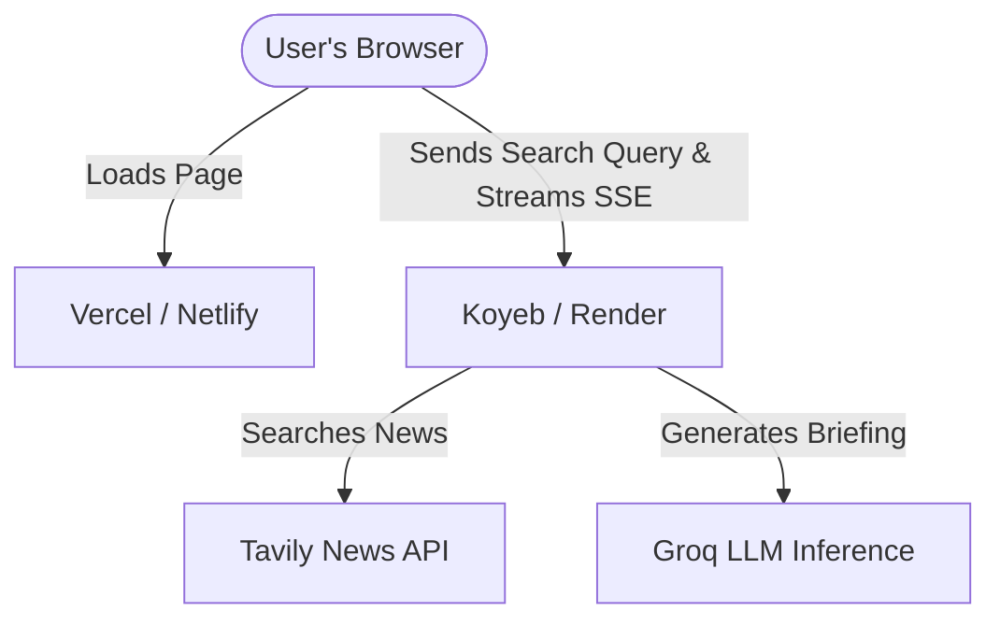

# AI News Agent: Free Deployment Guide

This guide describes how to deploy the **AI News Agent** (both backend and frontend) for free, using free-tier services.

---

## Architecture Overview



---

## Part 1: Deploying the Backend (FastAPI) for Free

For hosting Python servers with streaming (SSE) support, the best free-tier platforms are **Koyeb** or **Render**.
* **Koyeb** (Recommended): Does *not* sleep/spin down on the free tier, and provides fast response times.
* **Render**: Reliable, but sleep-based (spins down after 15 minutes of inactivity, causing a 50-second delay on first request).

### Option A: Hosting on Koyeb (Recommended)
1. **Create a Koyeb Account**: Go to [koyeb.com](https://www.koyeb.com) and sign up.
2. **Connect GitHub**: Commit your project repository to GitHub and connect it to Koyeb.
3. **Configure Service**:
   - **Repository**: Choose your `ai-news-agent` repository.
   - **Branch**: `main`.
   - **Work Directory**: Set to `/backend` (if you push the whole repo as-is) or root if you split it.
   - **Build Command**: `pip install -r requirements.txt` (Koyeb handles this automatically if Python is detected).
   - **Run Command**: `uvicorn main:app --host 0.0.0.0 --port 8000` (or let it auto-detect).
   - **Ports**: Add port `8000` (HTTP).
4. **Configure Environment Variables**:
   Add the following variables in the Koyeb panel:
   - `GROQ_API_KEY` = `your_actual_groq_api_key`
   - `TAVILY_API_KEY` = `your_actual_tavily_api_key`
5. **Deploy**: Click **Deploy**. Koyeb will compile your code and give you a public URL (e.g. `https://your-app-name.koyeb.app`).

### Option B: Hosting on Render
1. **Sign up on Render**: Go to [render.com](https://render.com).
2. **Create a New Web Service**: Select **New** > **Web Service** and link your GitHub repository.
3. **Configure Settings**:
   - **Root Directory**: `backend`
   - **Runtime**: `Python`
   - **Build Command**: `pip install -r requirements.txt`
   - **Start Command**: `uvicorn main:app --host 0.0.0.0 --port $PORT`
   - **Instance Type**: `Free`
4. **Add Environment Variables**:
   Go to the **Environment** tab and add:
   - `GROQ_API_KEY` = `your_actual_groq_api_key`
   - `TAVILY_API_KEY` = `your_actual_tavily_api_key`
5. **Deploy**: Render will build and deploy the application. It will give you a public URL (e.g. `https://ai-news-agent-backend.onrender.com`).

---

## Part 2: Deploying the Frontend (React + Vite) for Free

The React frontend is a static web application that can be hosted on **Vercel** or **Netlify** for free.

### Option A: Hosting on Vercel (Recommended)
1. **Sign up on Vercel**: Go to [vercel.com](https://vercel.com).
2. **Import Project**: Click **Add New** > **Project** and select your GitHub repository.
3. **Configure Settings**:
   - **Root Directory**: `frontend`
   - **Framework Preset**: `Vite` (auto-detected).
   - **Build Command**: `npm run build`
   - **Output Directory**: `dist`
4. **Add Environment Variables**:
   Under **Environment Variables**, add the URL of your deployed backend service:
   - `VITE_API_URL` = `https://your-app-name.koyeb.app` (or your Render backend URL)
5. **Deploy**: Click **Deploy**. Vercel will build your static files and deploy them. You will get a live URL (e.g. `https://ai-news-agent.vercel.app`).

---

## Part 3: Local Environment Setup

To run everything locally:
1. **Backend**:
   ```bash
   cd backend
   # Verify .env is present
   .\venv\Scripts\python main.py
   ```
   The backend will start at `http://localhost:8000`.

2. **Frontend**:
   ```bash
   cd frontend
   npm install
   npm run dev
   ```
   The frontend will start at `http://localhost:5173`. Open this URL in your browser.
